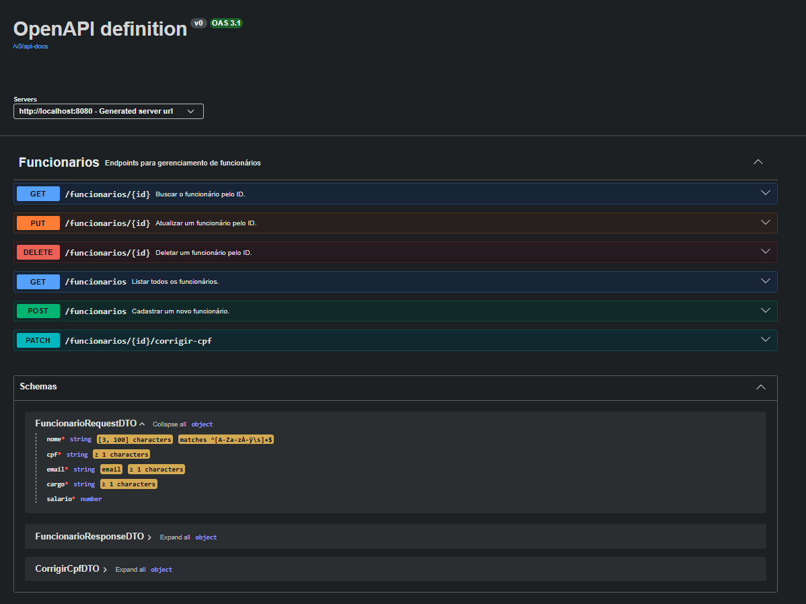

# 🚀 Cadastro e Gerenciamento de Funcionários (REST API)


## 🎯 Sobre o Projeto

### O que faz?
Esta aplicação é uma API RESTful completa desenvolvida para automatizar e centralizar o fluxo de **cadastro, consulta, atualização e remoção de funcionários**. Ela gerencia informações sensíveis como CPF, cargo, salário e data de admissão, oferecendo validações rigorosas e persistência segura em banco de dados relacional.

### Por que foi desenvolvido?
O projeto foi concebido para resolver o problema de inconsistência e duplicidade de dados em cadastros corporativos. Ele serve como uma demonstração prática de **arquitetura moderna Backend em Java**, aplicando os padrões de mercado exigidos na construção de APIs robustas, prontas para produção, testáveis e fáceis de manter.

---

## 🛠️ Tecnologias Utilizadas

* **Java 21** & **Spring Boot 3**
* **Spring Data JPA** & **Hibernate**
* **PostgreSQL** (Banco principal) & **H2 Database** (Perfil de testes)
* **Flyway** (Gerenciamento e versionamento do banco)
* **Bean Validation** (Validação automatizada de DTOs)
* **OpenAPI 3 / Swagger** (Documentação interativa)
* **Docker & Docker Compose** (Conteinerização de infraestrutura)
* **Maven** (Gerenciamento de dependências)

---

## 📐 Arquitetura e Boas Práticas

* **Camadas bem definidas:** Separação estrita entre Controllers, DTOs (Records), Services, Repositories e Models.
* **OpenAPI Separation:** Interface dedicada (`FuncionarioControllerAPI`) para isolar anotações da documentação Swagger da lógica do Controller.
* **Tratamento Global de Erros (`@RestControllerAdvice`):** Padronização de respostas de erro no formato REST com suporte a payloads inválidos, dados duplicados e exceções genéricas.
* **Sanitização de Dados:** Tratamento automático de máscaras (ex: CPF) salvando apenas números limpos na base.
* **Profiles de Ambiente:** Isolação entre ambiente PostgreSQL e perfil de testes (`application-test.properties`) com banco H2 em memória.

---

## 📌 Endpoints & Documentação Interativa

A documentação interativa completa (Swagger) pode ser acessada com a aplicação rodando em:  
👉 `http://localhost:8080/swagger-ui/index.html`



| Método | Endpoint | Descrição |
| :--- | :--- | :--- |
| `POST` | `/funcionarios` | Cadastra um novo funcionário |
| `GET` | `/funcionarios` | Lista todos os funcionários cadastrados |
| `GET` | `/funcionarios/{id}` | Busca um funcionário específico por ID |
| `PUT` | `/funcionarios/{id}` | Atualiza os dados completos de um funcionário |
| `PATCH` | `/funcionarios/{id}/corrigir-cpf` | Atualização parcial destinada à correção de CPF |
| `DELETE` | `/funcionarios/{id}` | Remove um funcionário pelo ID |

---

## ⚙️ Pré-requisitos

Para rodar o projeto, você precisará ter instalado em sua máquina:

* [Git](https://git-scm.com)
* [Docker Desktop](https://www.docker.com/products/docker-desktop/) (Recomendado)
* [Java 21 SDK](https://www.oracle.com/java/technologies/downloads/#java21) (Opcional, apenas se for executar fora do Docker)

---

## 🚀 Como Executar o Projeto

### Opção 1: Via Docker (Recomendado)

1. **Clone o repositório:**
   ```bash
   git clone https://github.com/seu-usuario/CadastroFuncionarios.git
   cd CadastroFuncionarios
